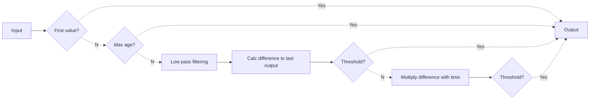

# Purpose
`wolf::low_pass_filter` implements a lowpass filter combined with thresholds: Input values are lowpass-filtered and transmitted only when certain thresholds are received.

# Filter constants
| Name | Description |
|------|-------------|
| `filter_constant` | Constant for the low-pass filter |
| `threshold` | Value difference threshold |
| `threshold_with_time` | Value * Time difference threshold |
| `max_age` | Maximum time between values|

# How it works
* The first value always triggers output
* If the last triggered value has been triggered earlier than `max_age`, trigger output
* Apply a low pass filter using `filtered_value = filtered_value + (value - filtered_value) * filter_constant`
* Calculate difference between last output and filtered value
* If that difference exceeds `threshold`, trigger output
* Multiply that difference with the time since the last value
* If that multiplied difference exceeds `threshold_with_time`, trigger output
* If output is triggered, save it and also set it as last `filtered_value`. Note that the unfiltered value is actually triggered.

# Flowchart

# Current filter constants
| Unit                 | LPF Parameter           | Configuration parameter                           | Default value
| ---- | ------------- | ----------------------- | -------------
| SHT25 Temperature    | `filter_constant`       | `sht25-temperature-filter-constant`               | `0.25`
| SHT25 Temperature    | `threshold`             | `sht25-temperature-filter-threshold`              | `1.0`
| SHT25 Temperature    | `threshold_with_time`   | `sht25-temperature-filter-threshold-with-time`    | `600`
| SHT25 Humidity       | `filter_constant`       | `sht25-humidity-filter-constant`                  | `0.25`
| SHT25 Humidity       | `threshold`             | `sht25-humidity-filter-threshold`                 | `2.0`
| SHT25 Humidity       | `threshold_with_time`   | `sht25-humidity-filter-threshold-with-time`       | `1200`
| SHT25 (All)          | `max_age`               | `sht25-filter-timeout`                            | `900` (seconds)
| SHTC1 Temperature    | `filter_constant`       | `shtc1-temperature-filter-constant`               | `0.25`
| SHTC1 Temperature    | `threshold`             | `shtc1-temperature-filter-threshold`              | `1.0`
| SHTC1 Temperature    | `threshold_with_time`   | `shtc1-temperature-filter-threshold-with-time`    | `600`
| SHTC1 Humidity       | `filter_constant`       | `shtc1-humidity-filter-constant`                  | `0.25`
| SHTC1 Humidity       | `threshold`             | `shtc1-humidity-filter-threshold`                 | `2.0`
| SHTC1 Humidity       | `threshold_with_time`   | `shtc1-humidity-filter-threshold-with-time`       | `1200`
| SHTC1 (All)          | `max_age`               | `shtc1-filter-timeout`                            | `900` (seconds)
| SCD30 Temperature    | `filter_constant`       | `scd30-temperature-filter-constant`               | `0.25`
| SCD30 Temperature    | `threshold`             | `scd30-temperature-filter-threshold`              | `1.0`
| SCD30 Temperature    | `threshold_with_time`   | `scd30-temperature-filter-threshold-with-time`    | `600`
| SCD30 Humidity       | `filter_constant`       | `scd30-humidity-filter-constant`                  | `0.25`
| SCD30 Humidity       | `threshold`             | `scd30-humidity-filter-threshold`                 | `2.0`
| SCD30 Humidity       | `threshold_with_time`   | `scd30-humidity-filter-threshold-with-time`       | `1200`
| SCD30 CO2            | `filter_constant`       | `scd30-co2-filter-constant`                       | `0.25`
| SCD30 CO2            | `threshold`             | `scd30-co2-filter-threshold`                      | `50.0`
| SCD30 CO2            | `threshold_with_time`   | `scd30-co2-filter-threshold-with-time`            | `30000`
| SCD30 (All)          | `max_age`               | `scd30-filter-timeout`                            | `900` (seconds)
| SGPC3 VOC            | `filter_constant`       | `sgpc3-voc-filter-constant`                       | `0.125`
| SGPC3 VOC            | `threshold`             | `sgpc3-voc-filter-threshold`                      | `5.0`
| SGPC3 VOC            | `threshold_with_time`   | `sgpc3-voc-filter-threshold-with-time`            | `3000`
| SGPC3 (All)          | `max_age`               | `sgpc3-filter-timeout`                            | `900` (seconds)

