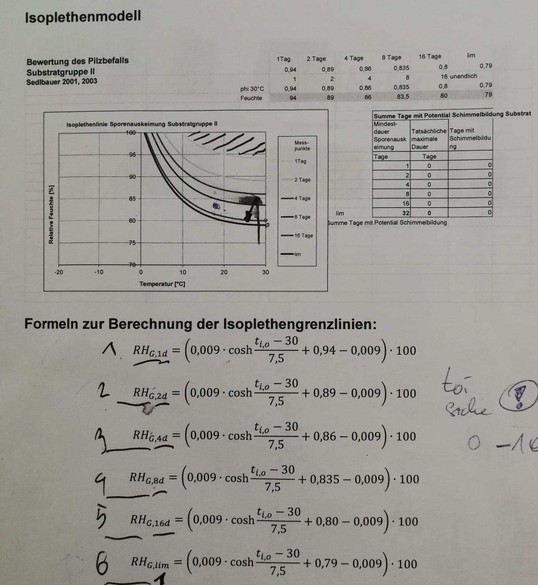

# How the sprout value is calculated
## Surface Temperature
An important value for sprout value calculation is the surface temperature. It represents the temperature on the surface (e. g. walls) mold can develop and it depends on the indoors and outdoors temperature and the temperature factor (frsi). The surface temperature needs to be low relative to the room temperature to increase the probability of mold. A low surface temperature will be calculated when the outdoor temperature is low.

The surface temperature gets calculated in the class `mold::surface_temperature_calculator` which gets used by the classes `mold::evaluation_humidity` and `mold::sprout::handler`.

## Evaluation Humidity
The evaluation humidity is relevant for the sprout probability. The higher the evaluation humidity, the higher the probability. It depends on the indoor and the surface temperature. A higher difference between the two temperatures leads to a higher evaluation humidity. The evaluation humidity is compared to all the border points of the isopleth curves and for every border point the evaluation humidity surpasses, timestamps are set.

This evaluation humidity gets calculated and saved per room in the class `mold::evaluation_humidity`

## Isopleth Curves
With these formulas the border points of the isopleth curves are calculated, which are later compared with the evaluation humidity.

When a new evaluation humidity got calculated the class `mold::sprout::handler` gets triggered. It calculates the curves and compares them to the evaluation humidity. The isopleth curves (or border points) get calculated by `mold::sprout::handler::border_points(...)`.

## Timestamps
The `mold::sprout::handler` sets the start timestamps for all isopleth curves, where the border points are surpassed. The timestamps for the other curves are set invalid.

Example: For simplicity there will be only 2 isopleth curves: 1 day and 2 days.
- Evaluation-Humidity is higher than isopleth curve of day 1 and day 2: `timestamp_start`/`timestamp_change` for both days get set to `now()`.
- 6 hours later the Evaluation-Humidity gets lower, so evaluation humidity is not higher that iospleth-curve-day-1. the times in isoplet-curve-day-1 get reseted (`optional`s). `timestamp_change` of isopleth-curve-day-2 gets set to `now()`. `timestamp_start` of isopleth-curve-day-2 does NOT change, because we never fell below isopleth-curve-day-2.
- so now we got a result of being for 6 hours (`now()-isopleth_curve_day2.timestamp_start`) in the isopleth-curve-day-2. which means there is a 12% chance for mold.

The result is a `sprout_value`. Which describes the isopleth curve we are currently in, when in startet and when it became active (`timestamp_change`).

## `mold_value_handler`
`mold_value_handler` uses the timestamps to calculate the percentage of the most progressed value. 
Example: we got a `sprout_value` with `sprout_type::one_day`. After 6 hours we got a `mold_value` of 25%.
This value is called `mold_value` is only used on the box.

## `configuration_state_handler`
`configuration_state_handler` checks the `mold_value` from `mold_value_handler`. Default when the percentage is above 75% percent the state becomes "yellow" and when it reaches 100% it becomes "red".
